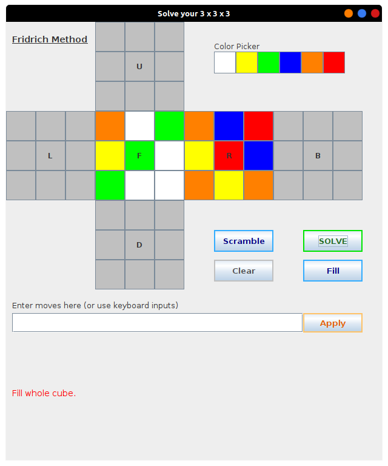
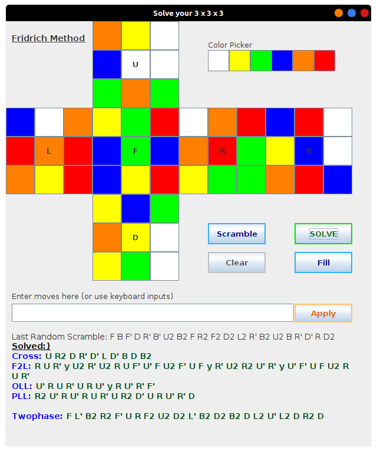

# Cube Solver
2D Rubik's cube simulator and solver made using java swing where user can interact with 2D map using keyboard controls and also solve their own by filling colors of their cube. It can solve any rubik's cube within a second and tells two different solutions, CFOP and Two-phase algorithm solution.

   

**Download and run CubeSolver.jar to try it out yourself.** (Java 8 or higher required)

(GUI is inspired from Kociemba's <a href = "http://kociemba.org/download.htm">Java package</a> and org.kociemba.twophase package also belongs to him.)
